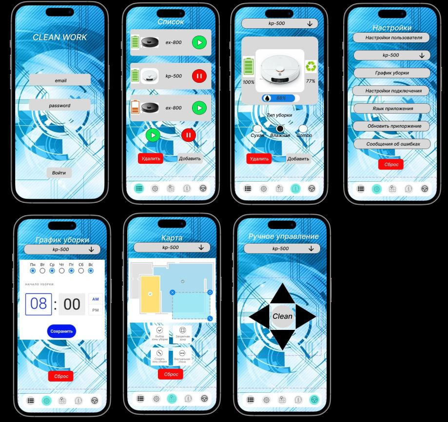

1) Разработать UseCase диаграмму для приложения управления роботом пылесосом

### UseCase_robot_vacuum_cleaner

2) Разработать UI/UX мобильного приложения управления роботом пылесосом Выполненную домашнюю работу выложить на свой GitHub в формате jpg

### UI_UX_FULL_robot_vacuum_cleaner

Инструменты:
https://www.figma.com/
https://app.diagrams.net/
https://www.dbdesigner.net/